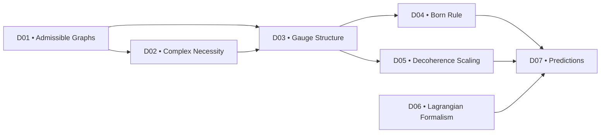

# Logic Field Theory (LFT)

**Deriving Quantum Field Theory from the Three Fundamental Laws of Logic**

Run in Gitpod without installing Lean 4:

**Draft Position Paper:** [Logic_Field_Theory_202508.pdf](https://github.com/jdlongmire/Logic_Field_Theory_202508/blob/main/LFT_001_Documents/Position%20Paper/Logic_Field_Theory_202508.pdf)

---

## Overview

Logic Field Theory (LFT) is a foundational program in quantum theory. It treats the **Three Fundamental Laws of Logic** (Identity, Non-Contradiction, Excluded Middle) as primitive constraints from which physics necessarily emerges.

Instead of taking quantum mechanics as a starting postulate, LFT derives its structure from logic itself.
---
The project combines **derivation papers**, **formal Lean 4 proofs**, and **AI-assisted theorem proving** to construct a fully verifiable framework.
---

## Derivation Flow

The seven core derivations (D01–D07) build on one another as follows:

---

## Author

**James D. Longmire**  
Northrop Grumman Fellow (independent research)  
Email: longmire.jd@gmail.com  
ORCID: [0009-0009-1383-7698](https://orcid.org/0009-0009-1383-7698)

---

## Collaboration

Seeking collaborators in:
- **Experimental physics**: testing decoherence scaling predictions
- **Formal methods**: completing Lean verifications
- **Quantum foundations**: extending the theoretical framework

---

## Methodological Note

This project pioneers **AI-assisted formal theorem proving** in theoretical physics. The conceptual framework and derivations are the author’s original work. Formal Lean proofs are developed in collaboration with multiple AI systems (Claude, ChatGPT, Grok, Gemini) and verified with Lean 4.

---

## License

- **Lean Code**: MIT License
- **Theory & Documentation**: CC BY-NC-SA 4.0

